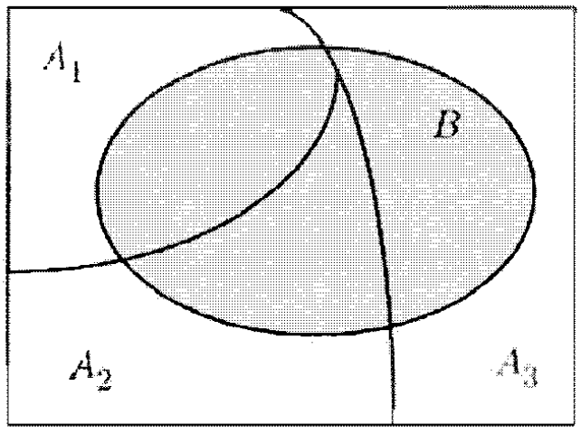

全概率定理和贝叶斯准则
==============================

全概率定理
----------------

.. important::

   **全概率定理**

   设 :math:`A_1, A_2, \cdots, A_n` 是样本空间的一个分割，且 :math:`P(A_i)>0`。
   对任何事件 :math:`B`，下列公式成立：

   .. math::

      P(B)=P(A_1\cap B)+\cdots+P(A_n\cap B)=\sum_{i=1}^{n} P(A_i)P(B|A_i)

.. note::

   直观上，将样本空间分割成若干事件 :math:`A_i` 的并，则任意事件 :math:`B` 的概率等于
   :math:`B` 在 :math:`A_i` 发生的情况下的条件概率的加权平均，而权重刚好等于这些事件
   :math:`A_i` 的无条件概率。

   直接计算事件 :math:`B` 的概率有难度，但若条件概率 :math:`P(B|A_i)` 是已知或容易计算，
   全概率定理就成为计算 :math:`P(B)` 的有力工具。

   应用定理关键在于找到合适的分割！

----

贝叶斯准则
---------------

全概率定理是与贝叶斯准则联系在一起的，贝叶斯准则将形如 :math:`P(A|B)` 的条件概率与 :math:`P(B|A)` 联系起来。

.. important::

   **贝叶斯准则**

   设 :math:`A_1, A_2, \cdots, A_n` 是样本空间的一个分割，且 :math:`P(A_i)>0`。
   对任何事件 :math:`B`，只要 :math:`P(B)>0`，下列公式成立：

   .. math::

      P(A_i|B)=\frac{P(A_i)P(B|A_i)}{P(B)}=\frac{P(A_i)P(B|A_i)}{\sum\limits_{i=1}^{n} P(A_i)(P(B|A_i)}

   其中，:math:`P(A_i)` 称为先验概率，:math:`P(A_i|B)` 称为后验概率。

.. note::

   贝叶斯准则可以用来进行因果推理。有许多原因可以造成某一结果，根据观察到的某一结果，
   希望推断造成这个结果出现的原因。